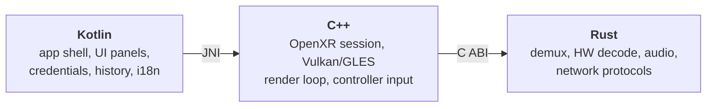

<div align="center">

<!-- GitHub status badges -->


<br/>

<!-- Technology badges -->


  <h3>tucaVR</h3>
  A fully immersive 2D/3D video player for the Meta Quest 3 that streams straight from your own NAS over SMB, NFS, FTP, SFTP, DLNA or HTTP(S).

**English** · [Português (BR)](README.pt-BR.md)

</div>

# 📖 About

**tucaVR** (from _Tamarutaca_, shortened to _tuca_) is an open source immersive media player for the Meta Quest 3 / Quest 3s. It runs as a **100% VR application** — a `NativeActivity` with `com.oculus.vr.mode = vr_only`, no classic flat Android UI — so the file browser, the network screens and the playback controls are all rendered as panels floating in 3D space.

The project is built on three languages, each doing what it is best at:



- **Kotlin** (`app/`) — Android shell and the UI, drawn as plain Android `View`s inside an `android.app.Presentation` on a `VirtualDisplay`, then projected as textures onto 3D quads by the native layer. Also handles encrypted credential storage, Room-backed playback history and localization.
- **C++** (`native/`) — OpenXR session, swapchains and the render loop on top of Meta's `SampleXrFramework` (OVRFW). Vulkan is the default backend, with an OpenGL ES path kept as a fallback. Decoded frames arrive as `AHardwareBuffer`s and are bound zero-copy as external textures.
- **Rust** (`rust/`) — cross-compiled to `aarch64-linux-android`. Demuxing with `ffmpeg-next`, hardware decoding through `ndk::MediaCodec`, audio output via Oboe, and every network protocol client written in pure Rust (no native TLS/SSH libraries, to keep cross-compilation sane).

Kotlin never calls Rust directly: it talks to C++ over JNI, and C++ is the only consumer of the Rust `bridge` crate's flat `extern "C"` API.

### What it plays

| Area          | Support                                                                                                  |
| ------------- | -------------------------------------------------------------------------------------------------------- |
| **Video**     | H.264, H.265/HEVC and AV1 with hardware decode (`MediaCodec`); containers handled by FFmpeg              |
| **3D / VR**   | Side-by-Side and Over/Under (half & full), 360° mono and stereo, VR180 — with automatic format detection |
| **Audio**     | Oboe output with A/V sync, spatial audio, per-track selection                                            |
| **Subtitles** | External subtitle files with automatic charset detection (`chardetng`)                                   |
| **Streaming** | HTTP(S) direct URLs and HLS (including AES-128 encrypted segments)                                       |
| **Rendering** | Vulkan by default, OpenGL ES available as a fallback backend                                             |

### Where it plays from

| Protocol         | Notes                                                          |
| ---------------- | -------------------------------------------------------------- |
| **SMB / CIFS**   | Pure-Rust SMB2/3 client with auto-reconnect for flaky Wi-Fi    |
| **NFS**          | Browse and play from NFS exports                               |
| **FTP**          | Pure-Rust blocking client                                      |
| **SFTP**         | Over SSH via `russh` — no `libssh2`/OpenSSL dependency         |
| **DLNA / UPnP**  | Device description + DIDL-Lite browsing                        |
| **HTTP / HTTPS** | Direct URLs, with `rustls` for TLS                             |
| **Discovery**    | Automatic mDNS / DNS-SD server discovery on the local network  |
| **Local files**  | On-device storage browsing with thumbnails and folder previews |

Remote reads go through a prefetching, chunked reader that issues concurrent range requests over a single session, so seeking on a NAS share does not stall the render loop.

### Quality of life

Playback history with "continue watching" and resume prompts, generated thumbnails for local and network files, encrypted credential storage (`EncryptedSharedPreferences`), saved servers, sorting and filtering in the file browser, thermal monitoring, and a fully localized UI (English and Portuguese-BR).

# 📋 Motivation

The project was born so I could reach my own files on my own NAS, over any network protocol, without having to pay 20 dollars for it — and as a hands-on performance experiment in Rust.

# 💻 Getting started

### Requirements

**Hardware**

- A **Meta Quest 3** or **Quest 3s** headset with developer mode enabled ([how to enable it](https://developers.meta.com/horizon/documentation/native/android/mobile-device-setup/)). The app targets `arm64-v8a` only and requires 6DoF head tracking.

**Toolchain**

| Tool                                                                                        | Version                                                      | Download                    |
| ------------------------------------------------------------------------------------------- | ------------------------------------------------------------ | --------------------------- |
| [Git](https://git-scm.com/downloads)                                                        | any                                                          | git-scm.com                 |
| [JDK (Temurin)](https://adoptium.net/temurin/releases/?version=17)                          | **17**                                                       | adoptium.net                |
| [Android SDK Platform](https://developer.android.com/studio)                                | **API 34** (min API 26)                                      | developer.android.com       |
| [Android NDK](https://developer.android.com/ndk/downloads)                                  | **26.3.11579264**                                            | developer.android.com       |
| [CMake](https://cmake.org/download/)                                                        | **3.22.1**                                                   | cmake.org                   |
| [Rust (rustup)](https://rustup.rs/)                                                         | stable                                                       | rustup.rs                   |
| [cargo-ndk](https://github.com/bbqsrc/cargo-ndk)                                            | latest                                                       | github.com/bbqsrc/cargo-ndk |
| [Android Platform Tools (adb)](https://developer.android.com/tools/releases/platform-tools) | latest                                                       | developer.android.com       |
| [Docker + Compose](https://docs.docker.com/get-docker/)                                     | _optional_ — only for the network protocol integration tests | docs.docker.com             |

> **Gradle is not in that list on purpose** — the repository ships the Gradle Wrapper (8.7), so `./gradlew` bootstraps it for you.

**Manual dependency**

The [Meta OpenXR Mobile SDK](https://developers.meta.com/horizon/downloads/package/oculus-openxr-mobile-sdk/) cannot be downloaded automatically — it requires accepting a license on Meta's portal. Extract it into `sdk/meta-openxr-sdk/` so that `sdk/meta-openxr-sdk/Samples/SampleXrFramework/` and `sdk/meta-openxr-sdk/OpenXR/` exist. That folder is gitignored; every machine needs its own copy.

### Installation

1. Clone the repository:

```sh
git clone https://github.com/bgluis/tucaVR.git
```

2. Enter the project directory:

```sh
cd tucaVR
```

3. Prepare the external dependencies (clones `ffmpeg-android-maker` and checks for the Meta SDK):

```sh
./scripts/setup-deps.sh
```

4. Cross-compile FFmpeg for `arm64-v8a` (one time only — it takes several minutes):

```sh
cd ffmpeg-android-maker
export ANDROID_SDK_HOME=$ANDROID_HOME
export ANDROID_NDK_HOME=$ANDROID_HOME/ndk/26.3.11579264
./ffmpeg-android-maker.sh --target-abis=arm64-v8a --android-api-level=26
cd ..
```

From here you can build in one of two ways.

#### Method A — unified build (recommended)

The unified script cross-compiles Rust, copies the resulting `.so` files into `jniLibs`, and then runs Gradle:

```sh
./scripts/build.sh          # Rust + C++ + Gradle
# or, equivalently:
make build                  # same as scripts/build.sh
make deploy                 # build + adb install on the connected headset
```

The APK lands in `app/build/outputs/apk/debug/app-debug.apk`.

#### Method B — step by step (manual)

Useful when you are iterating on a single layer and do not want to rebuild everything.

1. Compile the Rust workspace (must be `cargo ndk`, **not** plain `cargo build` — `core`, `audio` and `bridge` need the Android NDK toolchain):

```sh
cd rust
cargo ndk -t aarch64-linux-android -P 26 -o ../app/src/main/jniLibs build --release
cd ..
```

2. Copy the FFmpeg shared libraries next to them:

```sh
cp ffmpeg-android-maker/build/ffmpeg/arm64-v8a/lib/*.so app/src/main/jniLibs/arm64-v8a/
```

3. Build the Android app (this also triggers the CMake build of the native C++ layer):

```sh
./gradlew assembleDebug
```

4. Install it on the headset:

```sh
adb install -r app/build/outputs/apk/debug/app-debug.apk
```

> To build against the OpenGL ES fallback backend instead of Vulkan:
>
> ```sh
> ./gradlew assembleDebug -PvrplayerGraphicsApi=GLES
> ```

#### Build environment variables

`scripts/build.sh` sets these for you; you only need them when running the Rust build by hand:

| Variable                   | Purpose                                             | Default used by the script                                  |
| -------------------------- | --------------------------------------------------- | ----------------------------------------------------------- |
| `ANDROID_NDK_HOME`         | Path to NDK 26.3.11579264                           | `$ANDROID_HOME/ndk/26.3.11579264`                           |
| `ANDROID_NDK_ROOT`         | Same path — some tools read this one                | mirrors `ANDROID_NDK_HOME`                                  |
| `PKG_CONFIG_ALLOW_CROSS`   | Lets `pkg-config` resolve the cross-compiled FFmpeg | `1`                                                         |
| `PKG_CONFIG_PATH`          | Where the cross-compiled FFmpeg `.pc` files live    | `ffmpeg-android-maker/build/ffmpeg/arm64-v8a/lib/pkgconfig` |
| `BINDGEN_EXTRA_CLANG_ARGS` | Include paths and sysroot for the FFmpeg bindings   | NDK sysroot + FFmpeg headers                                |

# 🧪 Testing

`rust/core`, `rust/audio` and `rust/bridge` **do not compile on a normal host** — they pull in `ndk-sys`/`oboe-sys`, which expect the Android NDK toolchain. That is exactly why pure logic (A/V sync, resample math, playback clamps) was extracted into the dependency-free `media-logic` crate: so it can be tested on a laptop. See [`docs/TESTING-PLAN.md`](docs/TESTING-PLAN.md) for the full rationale.

```sh
# Rust unit tests (host-testable crates only)
cd rust && cargo test -p protocols -p media-logic

# Rust lint (CI runs this with -D warnings)
cd rust && cargo clippy -- -D warnings

# Kotlin JVM unit tests + lint
./gradlew testDebugUnitTest
./gradlew ktlintCheck
```

Network protocol integration tests run against real SMB/HTTP/HTTPS/FTP/SFTP servers in Docker — no headset required:

```sh
./scripts/test-network-protocols.sh          # spins containers up, runs, tears down
./scripts/test-network-protocols.sh --keep   # leaves them running for debugging
```

Anything that needs actual OpenXR rendering, controller haptics or hardware `MediaCodec` decode has **no automated coverage** and must be verified on a physical Quest 3. For the on-device debug HUD, forcing screen modes over adb and the optional Vulkan validation layers, see [`docs/DEBUGGING.md`](docs/DEBUGGING.md).

# 🤝 Contributors

Contributions are welcome — start with [`CONTRIBUTING.md`](CONTRIBUTING.md).

 <a href="https://github.com/bgluis/tucaVR/graphs/contributors">
   
 </a>
