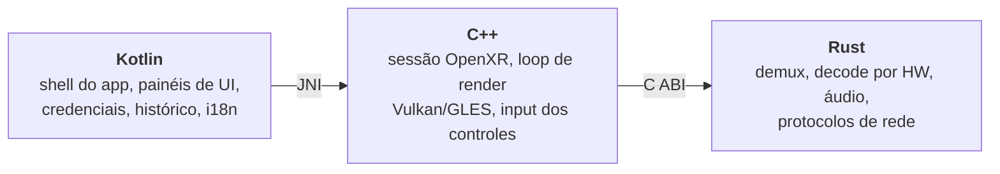

<div align="center">

<!-- Badges de Status do GitHub -->


<br/>

<!-- Badges das Tecnologias Utilizadas -->


  <h3>tucaVR</h3>
  Player de vídeo 2D/3D totalmente imersivo para o Meta Quest 3, que reproduz direto do seu NAS por SMB, NFS, FTP, SFTP, DLNA ou HTTP(S).

  [English](README.md) · **Português (BR)**

</div>

# 📖 Sobre

O **tucaVR** (de *Tamarutaca*, abreviado para *tuca*) é um player de mídia imersivo open source para Meta Quest 3 / Quest 3s. Ele roda como uma aplicação **100% VR** — uma `NativeActivity` com `com.oculus.vr.mode = vr_only`, sem nenhuma UI 2D clássica do Android — então o navegador de arquivos, as telas de rede e os controles de reprodução são todos renderizados como painéis flutuando no espaço 3D.

O projeto é construído em três linguagens, cada uma fazendo o que faz de melhor:



- **Kotlin** (`app/`) — shell Android e a UI, desenhada como `View`s comuns do Android dentro de um `android.app.Presentation` sobre um `VirtualDisplay`, e então projetada como textura em quads 3D pela camada nativa. Também cuida do armazenamento criptografado de credenciais, do histórico de reprodução (Room) e da localização.
- **C++** (`native/`) — sessão OpenXR, swapchains e o loop de renderização em cima do `SampleXrFramework` (OVRFW) da Meta. Vulkan é o backend padrão, com o caminho OpenGL ES mantido como fallback. Os frames decodificados chegam como `AHardwareBuffer` e são ligados como texturas externas em zero-copy.
- **Rust** (`rust/`) — cross-compilado para `aarch64-linux-android`. Demuxing com `ffmpeg-next`, decodificação por hardware via `ndk::MediaCodec`, saída de áudio pelo Oboe, e todos os clientes de protocolo de rede escritos em Rust puro (sem libs nativas de TLS/SSH, para não sofrer no cross-compile).

O Kotlin nunca chama o Rust diretamente: ele fala com o C++ por JNI, e o C++ é o único consumidor da API `extern "C"` da crate `bridge`.

### O que ele reproduz

| Área | Suporte |
|------|---------|
| **Vídeo** | H.264, H.265/HEVC e AV1 com decode por hardware (`MediaCodec`); containers tratados pelo FFmpeg |
| **3D / VR** | Side-by-Side e Over/Under (half e full), 360° mono e estéreo, VR180 — com detecção automática de formato |
| **Áudio** | Saída via Oboe com sincronia A/V, áudio espacial e seleção de faixa |
| **Legendas** | Arquivos de legenda externos com detecção automática de charset (`chardetng`) |
| **Streaming** | URLs diretas HTTP(S) e HLS (inclusive segmentos criptografados em AES-128) |
| **Renderização** | Vulkan por padrão, OpenGL ES disponível como backend de fallback |

### De onde ele reproduz

| Protocolo | Observações |
|-----------|-------------|
| **SMB / CIFS** | Cliente SMB2/3 em Rust puro, com reconexão automática para Wi-Fi instável |
| **NFS** | Navegar e reproduzir a partir de exports NFS |
| **FTP** | Cliente bloqueante em Rust puro |
| **SFTP** | Sobre SSH via `russh` — sem dependência de `libssh2`/OpenSSL |
| **DLNA / UPnP** | Device description + browsing DIDL-Lite |
| **HTTP / HTTPS** | URLs diretas, com `rustls` para TLS |
| **Descoberta** | Descoberta automática de servidores na rede local via mDNS / DNS-SD |
| **Arquivos locais** | Navegação no armazenamento do dispositivo, com thumbnails e prévias de pasta |

As leituras remotas passam por um leitor com prefetch e chunking, que dispara *range requests* concorrentes sobre uma mesma sessão — assim, dar seek num share do NAS não trava o loop de renderização.

### Qualidade de vida

Histórico de reprodução com "continuar assistindo" e prompt de retomada, thumbnails geradas para arquivos locais e de rede, armazenamento criptografado de credenciais (`EncryptedSharedPreferences`), servidores salvos, ordenação e filtros no navegador de arquivos, monitoramento térmico e uma UI totalmente localizada (inglês e português-BR).

# 📋 Motivo

O projeto foi criado com a ideia de poder acessar os meus próprios arquivos do meu NAS em qualquer protocolo de rede sem ter que pagar 20 dólares — e como uma experiência de performance em Rust.

# 💻 Como iniciar

### Requisitos

**Hardware**

- Um headset **Meta Quest 3** ou **Quest 3s** com modo desenvolvedor habilitado ([como habilitar](https://developers.meta.com/horizon/documentation/native/android/mobile-device-setup/)). O app tem como alvo apenas `arm64-v8a` e exige head tracking 6DoF.

**Toolchain**

| Ferramenta | Versão | Download |
|------------|--------|----------|
| [Git](https://git-scm.com/downloads) | qualquer | git-scm.com |
| [JDK (Temurin)](https://adoptium.net/temurin/releases/?version=17) | **17** | adoptium.net |
| [Android SDK Platform](https://developer.android.com/studio) | **API 34** (mín. API 26) | developer.android.com |
| [Android NDK](https://developer.android.com/ndk/downloads) | **26.3.11579264** | developer.android.com |
| [CMake](https://cmake.org/download/) | **3.22.1** | cmake.org |
| [Rust (rustup)](https://rustup.rs/) | stable | rustup.rs |
| [cargo-ndk](https://github.com/bbqsrc/cargo-ndk) | mais recente | github.com/bbqsrc/cargo-ndk |
| [Android Platform Tools (adb)](https://developer.android.com/tools/releases/platform-tools) | mais recente | developer.android.com |
| [Docker + Compose](https://docs.docker.com/get-docker/) | *opcional* — só para os testes de integração dos protocolos de rede | docs.docker.com |

> **O Gradle não está nessa lista de propósito** — o repositório já traz o Gradle Wrapper (8.7), então o `./gradlew` cuida disso pra você.

**Dependência manual**

O [Meta OpenXR Mobile SDK](https://developers.meta.com/horizon/downloads/package/oculus-openxr-mobile-sdk/) não pode ser baixado automaticamente — exige aceite de licença no portal da Meta. Extraia-o em `sdk/meta-openxr-sdk/` de forma que existam `sdk/meta-openxr-sdk/Samples/SampleXrFramework/` e `sdk/meta-openxr-sdk/OpenXR/`. Essa pasta é ignorada pelo git; cada máquina precisa da sua própria cópia.

### Instalação

1. Clone o repositório do projeto:
  ```sh
  git clone https://github.com/bgluis/tucaVR.git
  ```

2. Navegue até o diretório do projeto:
  ```sh
  cd tucaVR
  ```

3. Prepare as dependências externas (clona o `ffmpeg-android-maker` e verifica o SDK da Meta):
  ```sh
  ./scripts/setup-deps.sh
  ```

4. Compile o FFmpeg para `arm64-v8a` (só uma vez — leva vários minutos):
  ```sh
  cd ffmpeg-android-maker
  export ANDROID_SDK_HOME=$ANDROID_HOME
  export ANDROID_NDK_HOME=$ANDROID_HOME/ndk/26.3.11579264
  ./ffmpeg-android-maker.sh --target-abis=arm64-v8a --android-api-level=26
  cd ..
  ```

A partir daqui, você pode compilar de duas formas.

#### Método A — build unificado (recomendado)

O script unificado cross-compila o Rust, copia os `.so` resultantes para `jniLibs` e então roda o Gradle:

```sh
./scripts/build.sh          # Rust + C++ + Gradle
# ou, equivalentemente:
make build                  # o mesmo que scripts/build.sh
make deploy                 # build + adb install no headset conectado
```

O APK sai em `app/build/outputs/apk/debug/app-debug.apk`.

#### Método B — passo a passo (manual)

Útil quando você está iterando em uma única camada e não quer recompilar tudo.

1. Compile o workspace Rust (tem que ser `cargo ndk`, **não** `cargo build` puro — `core`, `audio` e `bridge` precisam da toolchain do NDK):
  ```sh
  cd rust
  cargo ndk -t aarch64-linux-android -P 26 -o ../app/src/main/jniLibs build --release
  cd ..
  ```

2. Copie as bibliotecas compartilhadas do FFmpeg para o mesmo lugar:
  ```sh
  cp ffmpeg-android-maker/build/ffmpeg/arm64-v8a/lib/*.so app/src/main/jniLibs/arm64-v8a/
  ```

3. Compile o app Android (isso também dispara o build CMake da camada nativa C++):
  ```sh
  ./gradlew assembleDebug
  ```

4. Instale no headset:
  ```sh
  adb install -r app/build/outputs/apk/debug/app-debug.apk
  ```

> Para compilar usando o backend de fallback OpenGL ES em vez do Vulkan:
> ```sh
> ./gradlew assembleDebug -PvrplayerGraphicsApi=GLES
> ```

#### Variáveis de ambiente do build

O `scripts/build.sh` já define todas elas; você só precisa configurá-las manualmente se for rodar o build do Rust na mão:

| Variável | Para que serve | Padrão usado pelo script |
|----------|----------------|--------------------------|
| `ANDROID_NDK_HOME` | Caminho do NDK 26.3.11579264 | `$ANDROID_HOME/ndk/26.3.11579264` |
| `ANDROID_NDK_ROOT` | Mesmo caminho — algumas ferramentas leem esta | espelha `ANDROID_NDK_HOME` |
| `PKG_CONFIG_ALLOW_CROSS` | Permite ao `pkg-config` resolver o FFmpeg cross-compilado | `1` |
| `PKG_CONFIG_PATH` | Onde ficam os `.pc` do FFmpeg cross-compilado | `ffmpeg-android-maker/build/ffmpeg/arm64-v8a/lib/pkgconfig` |
| `BINDGEN_EXTRA_CLANG_ARGS` | Include paths e sysroot para os bindings do FFmpeg | sysroot do NDK + headers do FFmpeg |

# 🧪 Testes

`rust/core`, `rust/audio` e `rust/bridge` **não compilam num host normal** — eles puxam `ndk-sys`/`oboe-sys`, que esperam a toolchain do NDK Android. É exatamente por isso que a lógica pura (sincronia A/V, matemática de resample, clamps de reprodução) foi extraída para a crate `media-logic`, sem dependências: para poder ser testada no notebook. Veja [`docs/TESTING-PLAN.md`](docs/TESTING-PLAN.md) para o raciocínio completo.

```sh
# Testes unitários Rust (só as crates testáveis no host)
cd rust && cargo test -p protocols -p media-logic

# Lint Rust (o CI roda isso com -D warnings)
cd rust && cargo clippy -- -D warnings

# Testes unitários JVM do Kotlin + lint
./gradlew testDebugUnitTest
./gradlew ktlintCheck
```

Os testes de integração dos protocolos de rede rodam contra servidores SMB/HTTP/HTTPS/FTP/SFTP reais em Docker — sem precisar de headset:

```sh
./scripts/test-network-protocols.sh          # sobe os containers, roda e derruba
./scripts/test-network-protocols.sh --keep   # deixa os containers de pé para debug
```

Tudo que depende de renderização OpenXR real, haptics dos controles ou decode por hardware no `MediaCodec` **não tem cobertura automatizada** e precisa ser verificado num Quest 3 físico. Para o HUD de debug no dispositivo, forçar screen modes via adb e as validation layers opcionais do Vulkan, veja [`docs/DEBUGGING.md`](docs/DEBUGGING.md).

# 🤝 Contribuidores

Contribuições são bem-vindas — comece pelo [`CONTRIBUTING.md`](CONTRIBUTING.md).

 <a href="https://github.com/bgluis/tucaVR/graphs/contributors">
   
 </a>

# 📄 Licença

Distribuído sob a Licença MIT. Veja [`LICENSE`](LICENSE) para os detalhes.
