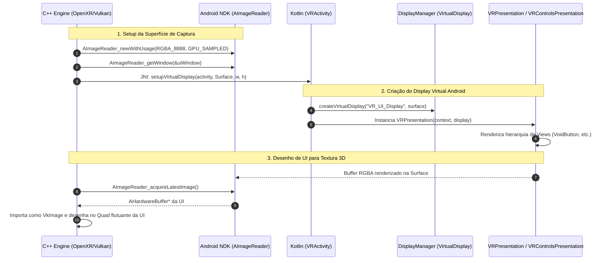
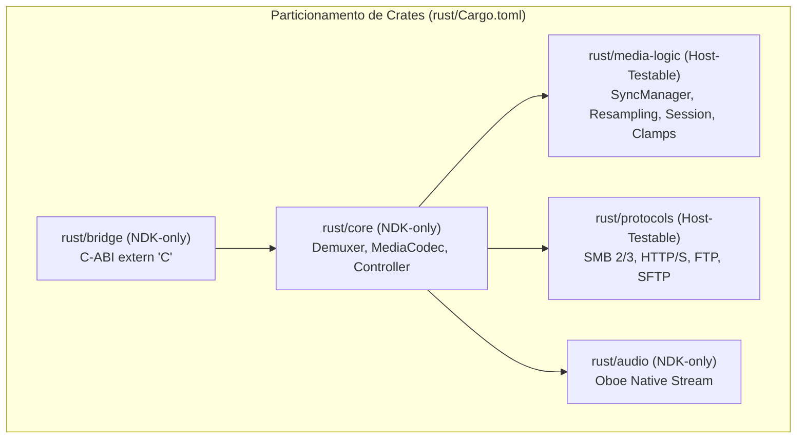
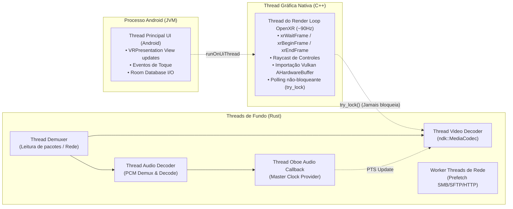
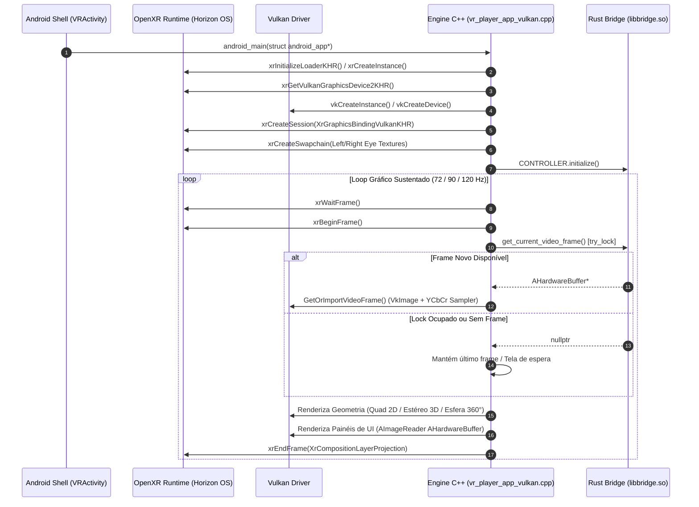
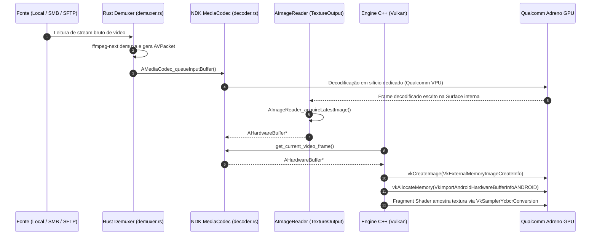
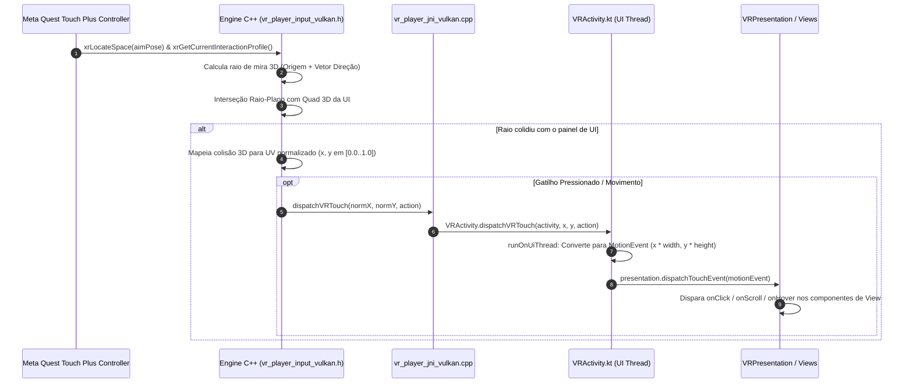
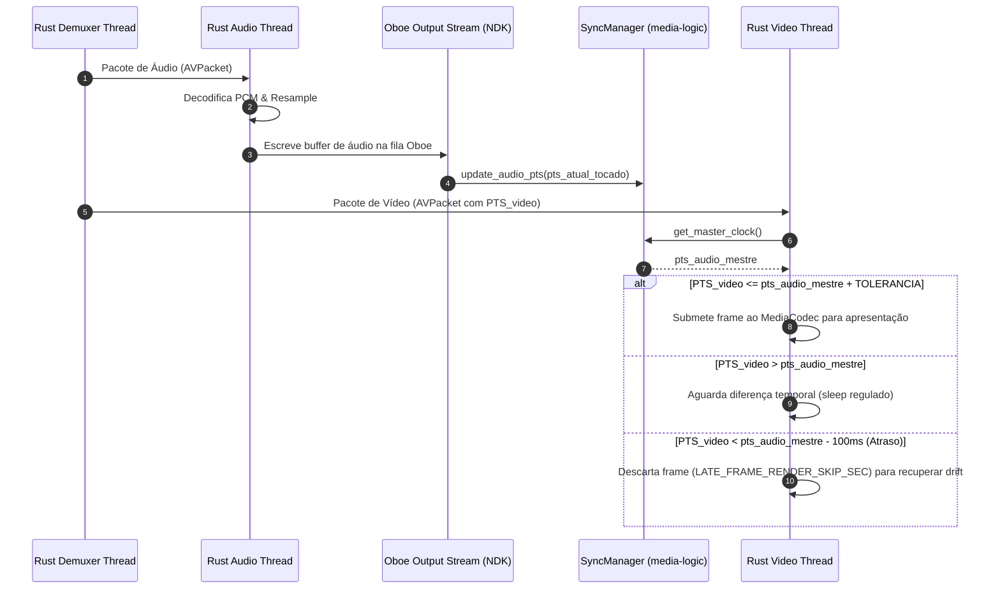

# 📐 Arquitetura do Sistema — tucaVR

> **Documento de Arquitetura Técnica Canônico**  
> **Plataforma Primária:** Meta Quest 3 (Qualcomm Snapdragon XR2 Gen 2 / Horizon OS)  
> **Modelo de Execução:** 100% Imersivo OpenXR (`NativeActivity`, `vr_only`)  
> **Padrão Tri-Layer:** Kotlin (Shell & UI) $\leftrightarrow$ C++ (OpenXR Engine & Vulkan/GLES) $\leftrightarrow$ Rust (Media & Streaming Engine)

---

## 1. Visão Geral e Metas de Engenharia

O **tucaVR** é um reprodutor de vídeo imersivo (2D, 3D Estereoscópico SBS/OU, 180° e 360°) concebido especificamente para headsets autônomos baseados na plataforma Qualcomm Snapdragon XR2 Gen 2 (Meta Quest 3).

Diferente de aplicações Android móveis tradicionais com janelas 2D planas sobrepostas a um viewport VR, o tucaVR opera exclusivamente como uma `NativeActivity` em modo imersivo integral (`<meta-data android:name="com.oculus.vr.mode" android:value="vr_only" />`). Não existem janelas ou `Activity`s 2D secundárias no processo.

```
┌─────────────────────────────────────────────────────────────────────────────┐
│                           METAS DE ENGENHARIA                               │
├─────────────────────────────────────────────────────────────────────────────┤
│  ⚡ Zero-Copy Streaming: Pipeline direto Decodificador HW -> GPU VRAM         │
│  🎯 72/90/120 Hz Sustentados: Loop de render OpenXR livre de bloqueios de E/S │
│  ⏱️ A/V Sync Estrito: Áudio como relógio mestre com correção proativa de drift│
│  👓 UI Espacial Flutuante: Telas do Android renderizadas em texturas 3D     │
│  🔒 Segurança e Isolamento: Credenciais cifradas e Rust memory-safe na rede  │
└─────────────────────────────────────────────────────────────────────────────┘
```

---

## 2. Topologia Tri-Layer e Contratos FFI

O sistema é estritamente particionado em três camadas concêntricas de software. Cada linguagem é designada para a sua zona de máxima eficiência:

```mermaid
flowchart TB
    subgraph KOTLIN ["1. Camada Kotlin (app/) — Shell, UI & Persistência"]
        VRActivity["VRActivity (NativeActivity Shell)"]
        VRPres["VRPresentation (UI do File Browser)"]
        VRCtrl["VRControlsPresentation (Barra de Controles VR)"]
        VRModal["VRModalPresentation (Diálogos e Modais)"]
        Crypto["EncryptedSharedPreferences (Credenciais)"]
        RoomDB["Room DB (Histórico de Reprodução)"]
    end

    subgraph JNI_BOUNDARY ["Fronteira JNI Bidirecional"]
        JNI_Calls["• C++ -> Kotlin: setupVirtualDisplay, dispatchVRTouch, runOnUiThread\n• Kotlin -> C++: nativeTogglePlayPause, nativeSeek, nativeStartVideo"]
    end

    subgraph CPP ["2. Camada C++ (native/) — OpenXR Engine & Rendering"]
        XrSession["OpenXR Session & Swapchain Loop (OVRFW)"]
        VkPipeline["Vulkan Render Pipeline (vr_player_app_vulkan.cpp)"]
        GlesPipeline["OpenGL ES Fallback (vr_player_app.cpp)"]
        Raycast["Raycast Controller Input (vr_player_input_vulkan.h)"]
        UiCapture["AImageReader Capture (UI/Controles/Modais -> Texturas)"]
    end

    subgraph CABI_BOUNDARY ["Fronteira C-ABI Plana (extern \"C\")"]
        CABI_Calls["• C++ -> Rust: get_current_video_frame, start_video_playback, seek_video_playback\n• Kotlin NUNCA chama Rust diretamente (ADR-002)"]
    end

    subgraph RUST ["3. Camada Rust (rust/) — Núcleo de Mídia e Streaming"]
        Bridge["rust/bridge (C-ABI libbridge.so)"]
        Demuxer["rust/core::demuxer (ffmpeg-next + Custom I/O)"]
        MediaCodec["rust/core::decoder (ndk::MediaCodec HW Decoder)"]
        SyncMgr["rust/media-logic::sync (SyncManager A/V Clock)"]
        AudioOut["rust/audio (Oboe NDK Low-Latency Audio)"]
        NetClients["rust/protocols (SMB 2/3, HTTP/S, FTP, SFTP em pure-Rust)"]
    end

    KOTLIN <--> JNI_BOUNDARY
    JNI_BOUNDARY <--> CPP
    CPP <--> CABI_BOUNDARY
    CABI_BOUNDARY <--> RUST
```

### 2.1 Papéis e Responsabilidades por Camada

| Camada | Linguagem | Módulos Principais | Responsabilidade |
| :--- | :--- | :--- | :--- |
| **Shell & UI** | Kotlin | `VRActivity.kt`, `VRPresentation.kt`, `VRControlsPresentation.kt`, `history/` | Orquestração do Android OS, desenho de UI nativa via `VirtualDisplay`, persistência com Room, credenciais cifradas (`EncryptedSharedPreferences`). |
| **XR Engine** | C++17 | `vr_player_app_vulkan.cpp`, `vr_player_app.cpp`, `vr_player_jni_vulkan.cpp` | Sessão OpenXR, swapchains, loop de desenho a 72/90/120 Hz, raycasting de controles Touch Plus, importação de `AHardwareBuffer` para Vulkan/GLES. |
| **Media Core** | Rust 2021 | `core`, `media-logic`, `protocols`, `audio`, `bridge` | Demuxing de arquivos locais e remotos, decodificação acelerada por hardware via NDK `MediaCodec`, saída de áudio com `Oboe`, clientes de rede seguros. |

### 2.2 A Regra Crítica FFI (ADR-002: Kotlin $\leftrightarrow$ Rust)

> [!IMPORTANT]
> **O Kotlin NUNCA chama o Rust diretamente.**
> Toda comunicação entre Kotlin e Rust passa obrigatoriamente pela camada C++. 
> 
> **Razão Arquitetural:** O render loop em C++ busca o ponteiro de frame decodificado (`get_current_video_frame()`) a cada quadro do headset (até 120 vezes por segundo). Uma chamada direta Kotlin $\leftrightarrow$ Rust via UniFFI adicionaria overhead desnecessário e isolaria o sincronismo do render loop gráfico do ciclo de vida dos buffers. C++ atua como o regente em tempo real entre os dados decodificados pelo Rust e a exibição no visor do Quest.

---

## 3. Pipeline Gráfico e OpenXR (Vulkan Primário & GLES Fallback)

O pipeline gráfico do tucaVR foi migrado para **Vulkan 1.1** como backend primário e padrão, mantendo um caminho completo em **OpenGL ES 3.2** para validação cruzada e fallback.

```
                  ┌─────────────────────────────────────┐
                  │    OpenXR Runtime (Horizon OS)      │
                  └──────────────────┬──────────────────┘
                                     │ xrGetVulkanGraphicsRequirements2KHR
                                     ▼
                  ┌─────────────────────────────────────┐
                  │      VkInstance / VkDevice          │
                  │   (Habilitadas extensões Android)   │
                  └───────┬─────────────────────┬───────┘
                          │                     │
          VK_ANDROID_external_memory            │ VK_KHR_sampler_ycbcr_conversion
                          ▼                     ▼
┌───────────────────────────────────┐ ┌───────────────────────────────────┐
│     AHardwareBuffer Importado     │ │  Sampler YCbCr Imutável (GPU)     │
│   (Zero-Copy do MediaCodec NDK)   │ │ (Conversão direta de espaço cores)│
└─────────────────┬─────────────────┘ └─────────────────┬─────────────────┘
                  │                                     │
                  └──────────────────┬──────────────────┘
                                     ▼
                  ┌─────────────────────────────────────┐
                  │   OpenXR Multiview Swapchain        │
                  │  (Stereo Projections / VR Screen)   │
                  └─────────────────────────────────────┘
```

### 3.1 Backend Primário: Vulkan (`vr_player_app_vulkan.cpp`)

1. **Extensões de Instância e Dispositivo:**
   - `VK_KHR_android_surface`
   - `VK_KHR_external_memory` e `VK_KHR_external_memory_fd`
   - `VK_ANDROID_external_memory_android_hardware_buffer`
   - `VK_KHR_sampler_ycbcr_conversion`
   - `VK_KHR_dedicated_allocation`
2. **Importação do Buffer do Vídeo (`GetOrImportVideoFrame`):**
   - O Rust fornece o ponteiro `AHardwareBuffer*` decodificado pelo MediaCodec.
   - O C++ consulta os requisitos de memória via `vkGetAndroidHardwareBufferPropertiesANDROID`.
   - Cria uma `VkImage` vinculada utilizando `VkExternalMemoryImageCreateInfo` e formato `VK_FORMAT_UNDEFINED` (o hardware decodificador gerencia o formato raw YUV).
   - Aloca `VkDeviceMemory` vinculada com `VkImportAndroidHardwareBufferInfoANDROID` usando `VK_MEMORY_PROPERTY_DEVICE_LOCAL_BIT`.
3. **Conversão de Cores YUV $\rightarrow$ RGB Zero-Overhead:**
   - Utiliza `VkSamplerYcbcrConversion` para permitir que o fragment shader amostre a `VkImage` externa diretamente como RGB via um sampler combinado, sem requerer múltiplos passes de shader na GPU.
4. **Cache de Frames (`videoImageCache`):**
   - O `MediaCodec` do Android reutiliza um conjunto fixo de instâncias de `AHardwareBuffer` (pool interno).
   - O C++ mantém um cache indexado pelo ponteiro `AHardwareBuffer*`, eliminando a recriação custosa de `VkImage` e alocações de memória a cada frame.
5. **Otimizações Específicas do Quest 3:**
   - **Foveated Rendering (`XR_FB_foveation`):** Reduz o custo de amostragem na visão periférica.
   - **Upscaling Vulkan (MQSR & SGSR1):** Filtros de super-resolução para manter nitidez em vídeos 1080p projetados em telas virtuais de alta densidade.

### 3.2 Backend de Fallback: OpenGL ES (`vr_player_app.cpp`)

- Utiliza `eglCreateImageKHR` com `EGL_NATIVE_BUFFER_ANDROID` apontando para o `AHardwareBuffer*`.
- Vincula a imagem com `glEGLImageTargetTexture2DOESTO` para uma textura `GL_TEXTURE_EXTERNAL_OES`.
- Fragment shaders customizados do OVRFW processam a amostragem via `samplerExternalOES`.

### 3.3 Modos de Projeção Estereoscópica (`ScreenMode`)

A enumeração `ScreenMode` é sincronizada entre Rust, C++ e Kotlin:

| ID | Modo | Geometria de Render | Mapeamento UV por Olho |
| :--- | :--- | :--- | :--- |
| `0` | **2D Flat** | Painel Quad plano flutuante | Ambos os olhos veem a textura completa $[0..1, 0..1]$. |
| `1` | **3D Side-by-Side (Half)** | Painel Quad plano | Olho Esquerdo: $U \in [0.0..0.5]$; Olho Direito: $U \in [0.5..1.0]$. |
| `2` | **3D Side-by-Side (Full)** | Painel Quad plano estendido | Olho Esquerdo: $U \in [0.0..0.5]$; Olho Direito: $U \in [0.5..1.0]$. |
| `3` | **3D Over/Under (Half)** | Painel Quad plano | Olho Esquerdo: $V \in [0.0..0.5]$; Olho Direito: $V \in [0.5..1.0]$. |
| `4` | **3D Over/Under (Full)** | Painel Quad plano estendido | Olho Esquerdo: $V \in [0.0..0.5]$; Olho Direito: $V \in [0.5..1.0]$. |
| `5` | **180° Monoscópico** | Cúpula Hemisférica 180° | Coordenadas esféricas projetadas igualmente para ambos os olhos. |
| `6` | **180° SBS Estéreo** | Cúpula Hemisférica 180° | Hemisfério dividido horizontalmente entre olho esquerdo e direito. |
| `7` | **360° Monoscópico** | Esfera Completa 360° | Projeção Equiretangular mapeada em esfera envolvente. |
| `8` | **360° SBS Estéreo** | Esfera Completa 360° | Esfera completa com amostragem estéreo esquerda/direita. |

---

## 4. Pipeline de Interface de Usuário (VirtualDisplay & Presentation)

Para garantir uma interface de usuário rica, dinâmica e consistente no Quest sem quebrar o modo `NativeActivity vr_only`, o tucaVR renderiza interfaces Android padrão (Views clássicas do pacote `com.tucavr.designsystem`) diretamente em `VirtualDisplay`s gerenciados pelo sistema operacional.



### 4.1 Tripla Superfície de UI

O sistema aloca três `VirtualDisplay`s simultâneos e independentes:
1. **File Browser / Biblioteca (`virtualDisplay`):** `kUiTexWidth = 1280`, `kUiTexHeight = 720` — gerenciado por `VRPresentation`. Contém a árvore de arquivos locais e compartilhamentos de rede.
2. **Barra de Controles de Reprodução (`controlsVirtualDisplay`):** `kControlsTexWidth = 1024`, `kControlsTexHeight = 160` — gerenciado por `VRControlsPresentation`. Barra curva flutuante abaixo da tela com Play/Pause, Seek bar, volume e seletores.
3. **Modais e Diálogos de Confirmação (`modalVirtualDisplay`):** `kModalTexWidth = 640`, `kModalTexHeight = 480` — gerenciado por `VRModalPresentation`.

### 4.2 Interação e Síntese de Toque (Raycasting de Controles)

A interação com a UI segue um pipeline de precisão geométrica em tempo real:
1. O C++ obtém a pose 6DoF do controle Touch Plus direito/esquerdo via `xrLocateSpace`.
2. Projeta um raio laser geométrico $\vec{R}(t) = \vec{O} + t \cdot \vec{D}$ no espaço 3D.
3. Realiza o teste de interseção raio-plano contra o Quad flutuante da UI.
4. Converte o ponto tridimensional do impacto em coordenadas UV normalizadas $x, y \in [0.0, 1.0]$.
5. Se houver colisão e o usuário acionar o gatilho (Trigger), o C++ invoca via JNI:
   ```kotlin
   VRActivity.dispatchVRTouch(activity, normX, normY, action)
   ```
6. O método Kotlin roda na UI Thread (`runOnUiThread`), escala as coordenadas para a resolução do display virtual (`normX * UI_WIDTH`, `normY * UI_HEIGHT`), instancia um `android.view.MotionEvent` legítimo (`ACTION_DOWN`, `ACTION_MOVE`, `ACTION_UP` ou `ACTION_HOVER_MOVE`) e o despacha diretamente para `presentation.dispatchTouchEvent(event)`.

---

## 5. Pipeline de Mídia e Sincronização A/V (Rust Engine)

A camada Rust é dividida em crates modulares para permitir testes unitários no host (desenvolvimento em laptop/CI) sem dependências do NDK do Android.



### 5.1 Pipeline de Vídeo Zero-Copy

```
┌─────────────────┐     ┌─────────────────┐     ┌───────────────────┐     ┌──────────────────┐
│  Fonte de Rede  │     │  Demuxer Rust   │     │ MediaCodec HW NDK │     │   ImageReader    │
│  ou Local       │ ──> │ (ffmpeg-next)   │ ──> │ (H.264/HEVC/AV1)  │ ──> │  (Surface NDK)   │
└─────────────────┘     └─────────────────┘     └───────────────────┘     └─────────┬────────┘
                                                                                    │
                                      AHardwareBuffer* Pointer (Zero-Copy)          ▼
┌─────────────────┐     ┌─────────────────┐     ┌───────────────────┐     ┌──────────────────┐
│  Olhos VR no    │ <── │ Fragment Shader │ <── │  VkSamplerYcbcr   │ <── │ VkImage Importada│
│  Meta Quest 3   │     │ (RGB Amostrado) │     │    Conversion     │     │ (Vulkan Memory)  │
└─────────────────┘     └─────────────────┘     └───────────────────┘     └──────────────────┘
```

1. O **Demuxer** (`demuxer.rs`) consome dados de arquivos locais ou canais customizados do Rust (`protocols`).
2. Pacotes de vídeo comprimidos são etiquetados com a época da geração atual (`TaggedPacket { epoch, packet }`) e enviados à fila do decodificador.
3. O decodificador **`ndk::MediaCodec`** decodifica os pacotes diretamente em uma superfície nativa do Android vinculada a um `AImageReader`.
4. O `AImageReader` retém os buffers de saída como ponteiros opacos `AHardwareBuffer*`.
5. O C++ obtém o ponteiro através de `get_current_video_frame()` e o mapeia diretamente na GPU Vulkan via `VkImportAndroidHardwareBufferInfoANDROID`, sem que nenhum byte de pixel trafegue pela CPU.

### 5.2 Sincronização A/V e Clock Master (`SyncManager`)

A sincronização de áudio e vídeo é regida pela classe `SyncManager` (`rust/media-logic/src/sync.rs`):

- **Áudio como Master Clock:** O fluxo de saída de áudio de baixa latência (`Oboe`) reporta seu PTS (*Presentation Time Stamp*) atual após processar cada buffer PCM (`update_audio_pts(pts)`).
- **Fallback para Relógio de Parede:** Se o vídeo não possui trilha sonora, ou durante o buffering inicial antes do primeiro pacote de áudio, o relógio mestre utiliza um relógio de sistema monotônico com compensação de escala de velocidade (`start_time.elapsed() * speed`).
- **Políticas de Descarte e Aceleração (Drift Compensation):**
  - **`LATE_FRAME_RENDER_SKIP_SEC` ($0.10\text{s} = 100\text{ms}$):** Se o frame decodificado chegar mais de 100ms atrasado em relação ao áudio, ele é descartado no momento da apresentação para não atrasar o render loop.
  - **`CATCH_UP_SKIP_THRESHOLD_SEC` ($0.50\text{s} = 500\text{ms}$):** Se o atraso acumulado exceder meio segundo (ex.: pico de latência de rede ou gargalo no decoder a 2x), pacotes de vídeo não-chave (frames B/P) são sumariamente descartados **antes** da decodificação até a próxima keyframe (frame I).

---

## 6. Modelo de Threads, Concorrência e Não-Bloqueio

A estabilidade do framerate em Realidade Virtual é mandatória para prevenir enjoo por movimento (*motion sickness*). Por essa razão, a arquitetura impõe uma separação rigorosa de threads e uma política de sincronização não-bloqueante no loop gráfico.



### 6.1 A Regra de Ouro do `try_lock()` no Render Loop

No bridge C-ABI (`rust/bridge/src/lib.rs`):
```rust
#[no_mangle]
pub extern "C" fn get_current_video_frame() -> *mut c_void {
    match CONTROLLER.try_lock() {
        Ok(controller) => controller.get_current_frame(),
        Err(_) => std::ptr::null_mut(),
    }
}
```
> [!CAUTION]
> O Render Loop OpenXR em C++ **nunca deve sofrer bloqueio de mutex**.
> Operações pesadas como abertura de arquivos remotos via SFTP/SMB ou busca de keyframes (`seek`) seguram o mutex do `PlaybackController` por centenas de milissegundos. Se `get_current_video_frame()` utilizasse um `lock()` bloqueante, o headset congelaria a renderização e o tracking de cabeça, gerando náusea instantânea no usuário. Utilizando `try_lock()`, se houver contenção temporária, a função retorna `null` e o C++ simplesmente repete o último frame ou renderiza a tela preta de espera, mantendo o headset a 90 FPS cravados.

### 6.2 Anel Circular de Erros (`ErrorRingBuffer`)

Falhas de I/O em threads secundárias do Rust não devem disparar exceções nem causar pânicos no processo. A crate `media-logic` implementa o `ErrorRingBuffer`, que armazena atomicamente os últimos erros ocorridos. A camada Kotlin consome periodicamente essa fila via polling leve (`take_last_playback_error()`) e exibe Toasts na interface sem qualquer sincronização bloqueante.

---

## 7. Ciclo de Vida e Gerenciamento de Foco (Horizon OS & ADR-006)

O ciclo de vida de uma aplicação VR no Horizon OS difere criticamente do ciclo de uma Activity Android de telefone.

### 7.1 Auto-Pausa Orientada a Eventos OpenXR

A aplicação é configurada no `AndroidManifest.xml` com:
```xml
<meta-data android:name="com.oculus.vr.focusaware" android:value="true" />
```

- **Por que `Activity.onPause()` não é confiável em VR:** Quando o usuário pressiona o botão Oculus/Horizon e abre o menu de sistema ou ativa o Passthrough, a aplicação continua visível no fundo. O Android **não** envia `onPause()` para uma Activity marcada como `focusaware`.
- **Decisão Arquitetural (ADR-006):** O gerenciamento de pausa e retomada é ditado estritamente pela máquina de estados da sessão OpenXR processada no C++:
  - `XR_SESSION_STATE_STOPPING` / `XR_SESSION_STATE_LOSS_PENDING`: Dispara auto-pausa nos decodificadores e no áudio.
  - `XR_SESSION_STATE_FOCUSED`: Retoma a reprodução caso o usuário estivesse assistindo antes da interrupção.
  - `Activity.onDestroy()`: É reservado unicamente para a destruição definitiva de superfícies, liberação de sockets e desmontagem do processo.

---

## 8. Segurança e Persistência de Dados

### 8.1 Armazenamento Criptografado de Credenciais de Rede

Servidores SMB, FTP e SFTP exigem armazenamento seguro de senhas e chaves privadas SSH.
- O tucaVR utiliza a biblioteca `androidx.security:security-crypto` (`EncryptedSharedPreferences`) através das classes `SmbCredentialStore`, `FtpCredentialStore` e `SftpCredentialStore`.
- As chaves de criptografia são gerenciadas diretamente pelo **Android Keystore hardware-backed** do processador Snapdragon XR2.
- Nenhuma senha ou chave privada é gravada em arquivos de texto plano ou exposta nos logs do logcat.

### 8.2 Histórico e Favoritos (Room Database)

A persistência do progresso dos vídeos e da biblioteca é gerenciada pelo **Android Room DB** (`PlaybackHistoryDatabase`), utilizando KSP para geração de código.
- As atualizações de progresso são throttled (estranguladas) para não gerar sobrecarga no disco de armazenamento flash do headset durante reproduções contínuas.

---

## 9. Diagramas de Sequência Detalhados

### 9.1 Inicialização e Render Loop OpenXR Vulkan



### 9.2 Pipeline de Vídeo Zero-Copy (Demux $\rightarrow$ MediaCodec $\rightarrow$ Vulkan)



### 9.3 Interação com a UI por Raycast e Disparo de Toque



### 9.4 Sincronização A/V (Audio Clock Master vs Video Frame Presentation)



---

## 10. Referências e Documentos Relacionados

Para detalhes complementares sobre subsistemas específicos do tucaVR:

- **[docs/REQUIREMENTS.md](file:///home/luis/Documents/hand-on/vr-multmidia/docs/REQUIREMENTS.md):** Requisitos de negócio, priorização de fases e registro histórico de ADRs (ADR-001 a ADR-006).
- **[docs/VULKAN-MIGRATION-PLAN.md](file:///home/luis/Documents/hand-on/vr-multmidia/docs/VULKAN-MIGRATION-PLAN.md):** Arquitetura detalhada da transição do pipeline gráfico GLES para Vulkan.
- **[docs/TESTING-PLAN.md](file:///home/luis/Documents/hand-on/vr-multmidia/docs/TESTING-PLAN.md):** Estratégia de isolamento de testes unitários host, testes Docker de protocolos de rede e testes em hardware real.
- **[docs/DEBUGGING.md](file:///home/luis/Documents/hand-on/vr-multmidia/docs/DEBUGGING.md):** Guia de depuração em dispositivo, comandos ADB, overlay de HUD em VR e inspeção de métricas de playback.
- **[docs/NETWORK-IO-PERFORMANCE.md](file:///home/luis/Documents/hand-on/vr-multmidia/docs/NETWORK-IO-PERFORMANCE.md):** Análise de buffers de streaming e comportamento do prefetcher de rede.
