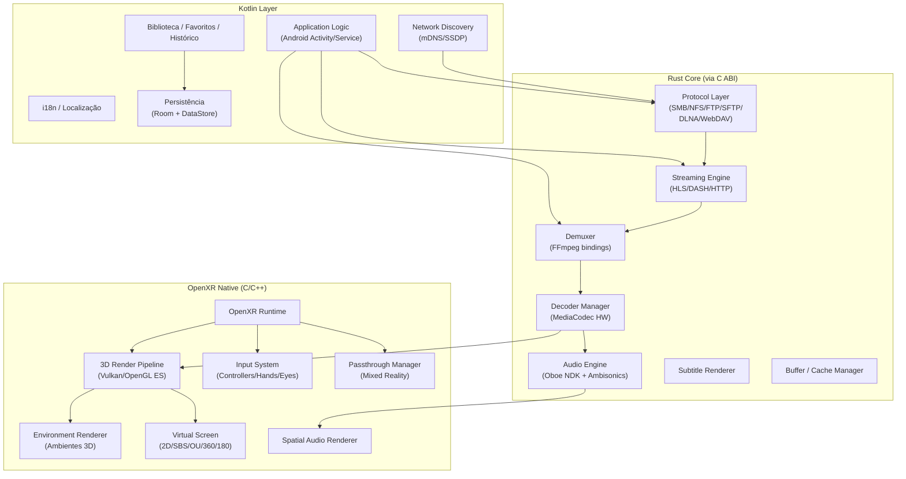

# 🥽 tucaVR — Documento de Requisitos (v0.2)

> **Projeto**: Player Multimídia 2D/3D para Realidade Virtual  
> **Stack**: Kotlin + Rust + OpenXR nativo (C/C++ para rendering)  
> **Plataforma Primária**: Meta Quest 3 (Qualcomm XR2 Gen 2)  
> **Licença**: MIT  
> **Uso Inicial**: Pessoal (possível publicação na Meta Quest Store no futuro)  
> **Status**: 🟢 Requisitos Definidos — Pronto para Arquitetura

---

## 1. Visão Geral

Reprodutor multimídia imersivo open source para óculos de realidade virtual. Combina:
- **Kotlin** para lógica de aplicação, gerenciamento de rede, persistência e UI de alto nível
- **Rust** para o núcleo de performance (decodificação, streaming, protocolos de rede)
- **OpenXR nativo (C/C++)** para rendering dos ambientes VR e pipeline gráfico

Foco em reprodução de conteúdo 2D e 3D com suporte robusto a protocolos de rede para NAS e servidores de mídia.

---

## 2. Arquitetura de Alto Nível

---

## 3. Requisitos Funcionais

### 3.1 Reprodução de Mídia 2D

| ID | Requisito | Prioridade | Fase |
|----|-----------|------------|------|
| RF-2D-001 | Reproduzir vídeos 2D em tela virtual plana no espaço VR | 🔴 Crítico | v0.1 |
| RF-2D-002 | Containers: MP4, MKV, AVI, MOV, WebM, FLV, TS | 🔴 Crítico | v0.1 |
| RF-2D-003 | Codecs vídeo: H.264, H.265/HEVC (HW decode obrigatório) | 🔴 Crítico | v0.1 |
| RF-2D-004 | Codecs vídeo: VP9, AV1 (HW decode quando disponível) | 🟡 Médio | v0.3 |
| RF-2D-005 | Codecs áudio: AAC, MP3, FLAC, Opus, AC3, DTS, TrueHD | 🔴 Crítico | v0.1 |
| RF-2D-006 | Legendas externas: SRT, SSA/ASS, VTT | 🟡 Médio | v0.2 |
| RF-2D-007 | Legendas embedded (MKV, MP4) + PGS bitmap | 🟡 Médio | v0.3 |
| RF-2D-008 | Redimensionar e reposicionar tela virtual livremente no espaço 3D | 🔴 Crítico | v0.1 |
| RF-2D-009 | Múltiplas telas virtuais simultâneas | 🟢 Baixo | v0.5 |
| RF-2D-010 | Reproduzir imagens (JPEG, PNG, WebP, AVIF, RAW) | 🟡 Médio | v0.3 |
| RF-2D-011 | Reproduzir áudio standalone (música, podcasts) | 🟡 Médio | v0.3 |

### 3.2 Reprodução de Mídia 3D / VR

| ID | Requisito | Prioridade | Fase |
|----|-----------|------------|------|
| RF-3D-001 | Vídeo 3D Side-by-Side (SBS) — half e full | 🔴 Crítico | v0.1 |
| RF-3D-002 | Vídeo 3D Over/Under (OU) — half e full | 🔴 Crítico | v0.1 |
| RF-3D-003 | Vídeo 360° monoscópico (equirectangular) | 🔴 Crítico | v0.2 |
| RF-3D-004 | Vídeo 360° estereoscópico (SBS/OU equirectangular) | 🔴 Crítico | v0.2 |
| RF-3D-005 | Vídeo 180° VR (VR180) | 🔴 Crítico | v0.2 |
| RF-3D-006 | Suporte a resolução até 8K para conteúdo VR | 🟡 Médio | v0.4 |
| RF-3D-007 | Projeções: Equirectangular, Cubemap, EAC (Equi-Angular Cubemap) | 🟡 Médio | v0.4 |
| RF-3D-008 | Fotos 360° e fotos 3D (SBS/OU) | 🟡 Médio | v0.3 |
| RF-3D-009 | Áudio espacial Ambisonics (1ª e 2ª ordem) | 🟡 Médio | v0.3 |
| RF-3D-010 | Áudio multicanal 5.1 e 7.1 virtualizado | 🟡 Médio | v0.3 |
| RF-3D-011 | Head tracking com latência < 20ms para conteúdo 360° | 🔴 Crítico | v0.2 |
| RF-3D-012 | Auto-detecção de formato 3D por metadados, filename, ou heurística | 🔴 Crítico | v0.2 |

### 3.3 Protocolos de Rede / NAS

| ID | Requisito | Prioridade | Fase |
|----|-----------|------------|------|
| RF-NET-001 | **SMB/CIFS** — Navegar e reproduzir de shares Windows / NAS | 🔴 Crítico | v0.1 |
| RF-NET-002 | **NFS** — Navegar e reproduzir de exports NFS | 🟡 Médio | v0.2 |
| RF-NET-003 | **FTP** — Conectar e navegar servidores FTP | 🟡 Médio | v0.2 |
| RF-NET-004 | **SFTP** — Conectar via SSH/SFTP seguro | 🟡 Médio | v0.2 |
| RF-NET-005 | **DLNA/UPnP** — Descoberta automática e browsing | 🔴 Crítico | v0.2 |
| RF-NET-006 | **WebDAV** — Conectar a servidores WebDAV | 🟢 Baixo | v0.4 |
| RF-NET-007 | **HTTP/HTTPS** — Reproduzir de URLs diretas | 🔴 Crítico | v0.1 |
| RF-NET-008 | **HLS** — HTTP Live Streaming | 🔴 Crítico | v0.2 |
| RF-NET-009 | **DASH** — Dynamic Adaptive Streaming | 🟡 Médio | v0.3 |
| RF-NET-010 | Descoberta automática de servidores (mDNS/SSDP/NetBIOS) | 🔴 Crítico | v0.2 |
| RF-NET-011 | Gerenciamento de conexões salvas (favoritos de servidores) | 🔴 Crítico | v0.2 |
| RF-NET-012 | Cache/buffer adaptativo para streaming de rede | 🔴 Crítico | v0.1 |

### 3.4 Interface de Usuário VR

| ID | Requisito | Prioridade | Fase |
|----|-----------|------------|------|
| RF-UI-001 | Menu principal imersivo em ambiente 3D | 🔴 Crítico | v0.1 |
| RF-UI-002 | Controles de reprodução flutuantes (play/pause/seek/volume/track) | 🔴 Crítico | v0.1 |
| RF-UI-003 | File browser com navegação hierárquica (local + rede) | 🔴 Crítico | v0.1 |
| RF-UI-004 | **Interação via Controllers** do Quest 3 (raycasting + botões) | 🔴 Crítico | v0.1 |
| RF-UI-005 | **Hand Tracking** — gestos naturais para controlar UI | 🟡 Médio | v0.3 |
| RF-UI-006 | **Eye Tracking** — seleção por olhar + foveated UI | 🟢 Baixo | v0.5 |
| RF-UI-007 | Teclado virtual para URLs, senhas, buscas | 🔴 Crítico | v0.1 |
| RF-UI-008 | Exibição de metadados (título, duração, resolução, codec, capa) | 🟡 Médio | v0.2 |
| RF-UI-009 | Gaze-based UI como fallback (sem controller) | 🟡 Médio | v0.4 |
| RF-UI-010 | Tema escuro otimizado para VR (baixo brilho para conforto) | 🔴 Crítico | v0.1 |

### 3.5 Ambientes Virtuais

| ID | Requisito | Prioridade | Fase |
|----|-----------|------------|------|
| RF-ENV-001 | **Void/Dark** — Ambiente escuro minimalista com tela flutuante | 🔴 Crítico | v0.1 |
| RF-ENV-002 | **Cinema** — Sala de cinema virtual com tela grande | 🟡 Médio | v0.3 |
| RF-ENV-003 | **Sala** — Ambiente doméstico com TV virtual | 🟡 Médio | v0.3 |
| RF-ENV-004 | **Espaço** — Ambiente cósmico/espacial | 🟢 Baixo | v0.5 |
| RF-ENV-005 | Ambientes customizáveis pelo usuário (importar modelos 3D) | 🟢 Baixo | v1.0 |
| RF-ENV-006 | **Passthrough/Mixed Reality** — Tela flutuante sobre mundo real | 🟡 Médio | v0.3 |
| RF-ENV-007 | Ajuste de iluminação e cor do ambiente | 🟢 Baixo | v0.5 |

### 3.6 Gestão de Conteúdo

| ID | Requisito | Prioridade | Fase |
|----|-----------|------------|------|
| RF-LIB-001 | Biblioteca local com scan automático de pastas | 🔴 Crítico | v0.1 |
| RF-LIB-002 | Histórico de reprodução com posição de retomada | 🔴 Crítico | v0.1 |
| RF-LIB-003 | Playlists personalizadas | 🟡 Médio | v0.3 |
| RF-LIB-004 | Busca e filtros (por nome, tipo, data, formato) | 🟡 Médio | v0.2 |
| RF-LIB-005 | Favoritos/bookmarks de arquivos e servidores | 🟡 Médio | v0.2 |
| RF-LIB-006 | Download de mídia para reprodução offline | 🟡 Médio | v0.4 |

### 3.7 Internacionalização (i18n)

| ID | Requisito | Prioridade | Fase |
|----|-----------|------------|------|
| RF-I18N-001 | Sistema de i18n com resource bundles desde o início | 🔴 Crítico | v0.1 |
| RF-I18N-002 | Português (BR) como idioma padrão | 🔴 Crítico | v0.1 |
| RF-I18N-003 | Inglês completo | 🔴 Crítico | v0.1 |
| RF-I18N-004 | Espanhol | 🟡 Médio | v0.3 |
| RF-I18N-005 | Sistema de contribuição de traduções (community) | 🟢 Baixo | v1.0 |

> RF-I18N-001/002/003 implementados na v0.1 (ver `docs/phases/PHASE-0.1-MVP.md`,
> secao 8, T8.1-T8.5) — processo completo (convenção de naming, como adicionar
> um idioma novo, achado sobre a camada C++) documentado em `docs/i18n.md`.
> Nota sobre RF-I18N-002 ("Português BR como idioma padrão"): a pasta
> `res/values/` (default/fallback do Android resource system) contém o
> **inglês**, com `res/values-pt-rBR/` como override específico — é a
> convenção padrão do Android (fallback universal + override regional) e é o
> que T8.1/T8.2 pedem explicitamente; "idioma padrão" aqui foi interpretado
> como "idioma em que o produto foi concebido/testado primeiro", não como
> "conteúdo da pasta sem qualifier".

---

## 4. Requisitos Não-Funcionais

### 4.1 Performance

| ID | Requisito | Meta | Fase |
|----|-----------|------|------|
| RNF-PERF-001 | FPS constante no rendering VR | ≥ 72 FPS (ideal 90 FPS) | v0.1 |
| RNF-PERF-002 | Latência motion-to-photon para 360° | < 20ms | v0.2 |
| RNF-PERF-003 | Tempo de início de reprodução | < 2s (local), < 5s (rede) | v0.1 |
| RNF-PERF-004 | Uso de memória RAM | < 2.5GB | v0.1 |
| RNF-PERF-005 | Decodificação por hardware via MediaCodec | Obrigatório | v0.1 |
| RNF-PERF-006 | Monitoramento e reação a thermal throttling | Obrigatório | v0.2 |
| RNF-PERF-007 | Adaptive quality (downscale se overheating) | Obrigatório | v0.3 |
| RNF-PERF-008 | Foveated rendering para ambientes (economia GPU) | Recomendado | v0.4 |

### 4.2 Compatibilidade

| ID | Requisito | Tipo |
|----|-----------|------|
| RNF-COMP-001 | Meta Quest 3 | ✅ Primário |
| RNF-COMP-002 | Meta Quest 3S | 🟡 Secundário |
| RNF-COMP-003 | Meta Quest Pro | 🟡 Secundário |
| RNF-COMP-004 | Meta Quest 2 | ⚪ Legado (sem garantia 8K) |
| RNF-COMP-005 | Futuros headsets Android XR / OpenXR | 📋 Planejado |
| RNF-COMP-006 | OpenXR 1.0+ runtime | Obrigatório |
| RNF-COMP-007 | Android API 29+ (Android 10) | Obrigatório |
| RNF-COMP-008 | Vulkan 1.1+ ou OpenGL ES 3.2 | Obrigatório |

### 4.3 Segurança

| ID | Requisito | Prioridade |
|----|-----------|------------|
| RNF-SEC-001 | Credenciais de servidores criptografadas (AES-256 + Android Keystore) | 🔴 Crítico |
| RNF-SEC-002 | TLS/SSL para todas as conexões de rede | 🔴 Crítico |
| RNF-SEC-003 | Sem telemetria / analytics (open source, uso pessoal) | 🔴 Crítico |
| RNF-SEC-004 | Validação de certificados SSL (com opção de aceitar self-signed) | 🟡 Médio |

### 4.4 Qualidade de Código

| ID | Requisito | Meta |
|----|-----------|------|
| RNF-QUAL-001 | Testes unitários Rust core | ≥ 80% cobertura |
| RNF-QUAL-002 | Testes de integração Kotlin ↔ Rust (JNI) | Obrigatório |
| RNF-QUAL-003 | CI/CD (GitHub Actions) | Build + Test automático |
| RNF-QUAL-004 | Linting: `clippy` (Rust) + `ktlint` (Kotlin) | Obrigatório |
| RNF-QUAL-005 | Documentação de API pública | Obrigatório |
| RNF-QUAL-006 | Logging estruturado (níveis: trace/debug/info/warn/error) | Obrigatório |

---

## 5. Stack Tecnológico Definido

### 5.1 Kotlin Layer (Aplicação Android)
| Componente | Tecnologia | Justificativa |
|------------|------------|---------------|
| Build system | Gradle (AGP) + KTS | Padrão Android |
| DI | Koin | Leve, KMP-friendly |
| Persistência | Room + DataStore | Biblioteca, histórico, settings |
| Networking (discovery) | Ktor Client | Coroutines-native |
| i18n | Android Resources (strings.xml) | Padrão Android, ferramentas maduras |
| Interop Rust | Indireto via C++ (JNI → C++ → Rust C ABI) | Kotlin nunca chama Rust diretamente (ver ADR-002) |

### 5.2 Rust Core (Performance)
| Componente | Tecnologia | Justificativa |
|------------|------------|---------------|
| Demuxing | `ffmpeg-next` (bindings FFmpeg) | Suporte universal a containers/codecs |
| HW Decode | Android MediaCodec (via NDK) | Decodificação por hardware no XR2 |
| Áudio | `oboe` (Google Oboe NDK) | Baixa latência no Android |
| Ambisonics | `ambisonics` crate ou custom | Áudio espacial |
| Streaming | `reqwest` + `tokio` | HTTP/HLS/DASH async |
| SMB | `smb2` crate | Shares Windows/NAS |
| NFS | `nfs-client` ou binding `libnfs` | NFS shares |
| FTP/SFTP | `suppaftp` + `russh`/`russh-sftp` | Transferência de arquivos |
| DLNA/UPnP | `rupnp` | Descoberta automática |
| WebDAV | `reqwest` + custom DAV parser | WebDAV protocol |
| Subtitles | `subparse` + custom ASS renderer | Legendas |
| Async runtime | `tokio` | Async I/O |
| Serialization | `serde` | Config, cache |
| Build target | `aarch64-linux-android` | Quest 3 ARM64 |
| C ABI bridge | `extern "C"` em `rust/bridge/` | Interface C++↔Rust (ver ADR-002) |

### 5.3 OpenXR / C++ Layer (VR Rendering)
| Componente | Tecnologia | Justificativa |
|------------|------------|---------------|
| VR Runtime | OpenXR 1.0 (Meta OpenXR loader) | Padrão da indústria |
| Graphics API | Vulkan 1.1 (default, via migração — ver ADR-003) | Controle fino do pipeline, compute shaders futuros |
| Fallback | OpenGL ES 3.x (via OVRFW, `-PvrplayerGraphicsApi=GLES`) | Mantido como caminho alternativo |
| Passthrough | Meta Passthrough API (XR extension) | Mixed reality |
| Hand tracking | XR_EXT_hand_tracking | Gestos naturais |
| Eye tracking | XR_EXT_eye_gaze_interaction | UI por olhar |
| Environment | Meshes customizados + skyboxes | Ambientes 3D |
| Shader lang | GLSL → SPIR-V (Vulkan, via `glslc`) / GLSL (GLES fallback) | Shaders em `native/shaders/vulkan/` |
| Math | `glm` | Álgebra linear |

### 5.4 Build & Tooling
| Componente | Tecnologia |
|------------|------------|
| Monorepo | Cargo workspace + Gradle modules |
| Rust → Android | `cargo-ndk` |
| Cross-compile | Android NDK r26+ |
| CI/CD | GitHub Actions |
| Linting | `clippy` + `ktlint` + `clang-tidy` |
| Docs | `rustdoc` + `dokka` |

---

## 6. Fases de Desenvolvimento (Roadmap)

### v0.1 — MVP (Fundação)
> Reproduzir um vídeo 2D local em tela virtual no Quest 3

- [x] Setup do monorepo (Kotlin + Rust + C++)
- [ ] Pipeline básico: demux → decode (HW) → render em quad
- [ ] Ambiente void (tela flutuante em fundo escuro)
- [ ] Controles básicos (play/pause/seek) via controllers
- [ ] File browser local (armazenamento do Quest)
- [ ] SMB básico (navegar e reproduzir de NAS)
- [ ] HTTP URL playback
- [ ] i18n setup (PT-BR + EN)
- [ ] Histórico de reprodução

### v0.2 — 3D & Network
> Conteúdo 3D e integração com rede

- [ ] Reprodução SBS / Over-Under / 360° / 180°
- [ ] Auto-detecção de formato 3D
- [ ] Head tracking para conteúdo 360°
- [ ] DLNA/UPnP discovery
- [ ] NFS, FTP, SFTP
- [ ] HLS streaming
- [ ] Legendas (SRT, VTT)
- [ ] Busca e filtros na biblioteca
- [ ] Thermal monitoring

### v0.3 — Polish & Audio
> Ambientes, áudio espacial, hand tracking

- [ ] Ambientes: Cinema, Sala
- [ ] Passthrough / Mixed Reality
- [ ] Áudio espacial Ambisonics + 5.1/7.1
- [ ] Hand tracking
- [ ] VP9/AV1 decode
- [ ] Legendas ASS/PGS
- [ ] Fotos 360° e 3D
- [ ] Playlists
- [ ] Espanhol (i18n)

### v0.4 — Advanced
> Features avançadas

- [ ] Suporte 8K com adaptive quality
- [ ] DASH streaming
- [ ] WebDAV
- [ ] Download offline
- [ ] Foveated rendering
- [ ] Projeções avançadas (Cubemap, EAC)

### v0.5 — Premium
> Features diferenciadas

- [ ] Múltiplas telas
- [ ] Eye tracking UI
- [ ] Ambientes Espaço + mais
- [ ] Ajuste de iluminação do ambiente

### v1.0 — Release
> Produção

- [ ] Ambientes customizáveis (importar modelos 3D)
- [ ] Community translations
- [ ] Polimento final de UX
- [ ] Documentação completa
- [ ] Possível submissão à Meta Quest Store

---

## 7. Riscos e Mitigações

| # | Risco | Prob. | Impacto | Mitigação |
|---|-------|-------|---------|-----------|
| 1 | **Decodificação 8K excede capacidade do XR2 Gen 2** | Alta | Alto | Downscale adaptativo, tiling, foveated decode |
| 2 | **FFmpeg licenciamento (LGPL/GPL)** | Média | Alto | Linking dinâmico, audit de features GPL |
| 3 | **Complexidade tri-layer (Kotlin/Rust/C++)** | Alta | Alto | C API minimalista (`extern "C"`) Rust↔C++, JNI manual limitado Kotlin↔C++ (ver ADR-002) |
| 4 | **Thermal throttling em sessões longas** | Alta | Médio | Monitor térmico + adaptive quality + limitar ambiente |
| 5 | **OpenXR extensions variam entre headsets** | Média | Médio | Feature detection + graceful degradation |
| 6 | **SMB/NFS em Rust pode ser imaturo** | Média | Médio | Fallback para bindings de libs C (libsmbclient, libnfs) |
| 7 | **Ambisonics rendering é computacionalmente pesado** | Média | Médio | HOA → FOA downmix se GPU overloaded |
| 8 | **8K decode + spatial audio + environment = orçamento de GPU esgotado** | Alta | Alto | Budget manager: simplificar ambiente em conteúdo pesado |

---

## 8. Decisões Arquiteturais (ADRs)

### ADR-001: Monorepo
**Decisão**: Kotlin + Rust + C++ no mesmo repositório.  
**Razão**: Simplifica CI/CD, versionamento sincronizado, mais fácil para um desenvolvedor solo.

### ADR-002: Bridge Kotlin ↔ C++ via JNI manual, C++ ↔ Rust via C ABI (revisado, v0.1)
**Decisão original**: Usar Mozilla UniFFI para o bridge Kotlin ↔ Rust ao invés de JNI manual.
**Decisão revisada**: Abandonado. Na prática, o Kotlin nunca chama o Rust diretamente — o C++ (camada OpenXR) é o único consumidor da API do Rust, via um punhado de funções `extern "C"` simples em `rust/bridge/src/lib.rs`. Isso não é incidental: o render loop do C++ precisa buscar o frame de vídeo decodificado a cada frame (até 90x/s), o que exige uma chamada síncrona e de baixíssimo overhead — um round-trip UniFFI/JNI por frame seria a escolha errada ali. Já os controles vindos do Kotlin (play/pause/seek) chegam ao Rust passando pelo C++ (JNI manual em `vr_player_app.cpp`), não diretamente. Como não existe nenhum caminho de chamada Kotlin→Rust direto, um bridge UniFFI nunca teve propósito real neste projeto. O scaffolding do UniFFI (`.udl`, `uniffi::include_scaffolding!`) foi removido — ficava sem uso, só a função `hello_world()` de exemplo era gerada.
**Razão da mudança**: documentar a arquitetura que de fato existe e funciona, em vez de manter uma decisão nunca implementada. Se no futuro o Kotlin precisar falar com o Rust sem passar pelo C++ (ex: para funcionalidades de rede/biblioteca que não envolvem o render loop), UniFFI pode ser reavaliado nesse contexto específico.

### ADR-003: Vulkan como API gráfica primária
**Decisão**: Vulkan 1.1 com fallback OpenGL ES 3.2.  
**Razão**: Performance máxima no Quest 3, controle fino sobre rendering pipeline.

### ADR-004: FFmpeg para demuxing
**Decisão**: Usar FFmpeg (via `ffmpeg-next` crate) para demuxing.  
**Razão**: Suporte universal a containers e codecs, comunidade enorme.

### ADR-005: MIT License
**Decisão**: Projeto sob licença MIT.  
**Razão**: Máxima permissividade, compatível com distribuição futura na Quest Store.

---

## 9. Itens Excluídos da v1 (Backlog Futuro)

| Item | Razão da exclusão |
|------|-------------------|
| DRM (Widevine) | Complexidade alta, possível em v2 |
| Social / Watch Party | Foco em uso pessoal |
| Cloud storage (Drive/Dropbox/OneDrive) | Não necessário agora |
| IPTV / Câmeras IP | Não necessário na v1 |
| App companion (celular/desktop) | Gestão direto no headset |
| Gravação/Captura de tela | Fora do escopo de player |

---

*Documento atualizado em: 2026-08-07 | Versão: 0.2 — Pós Discovery*
